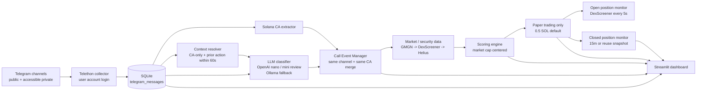
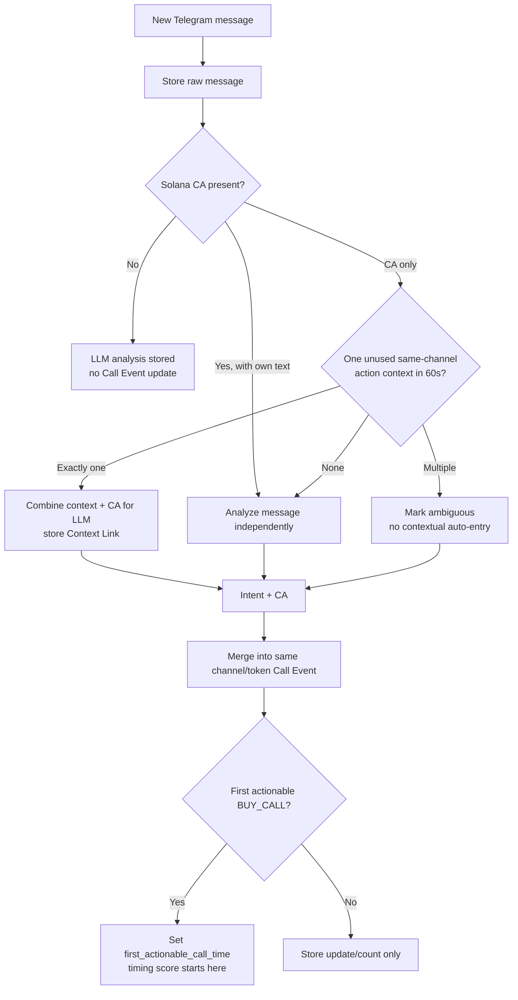
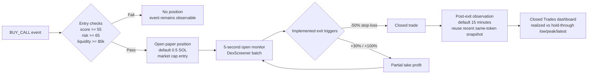
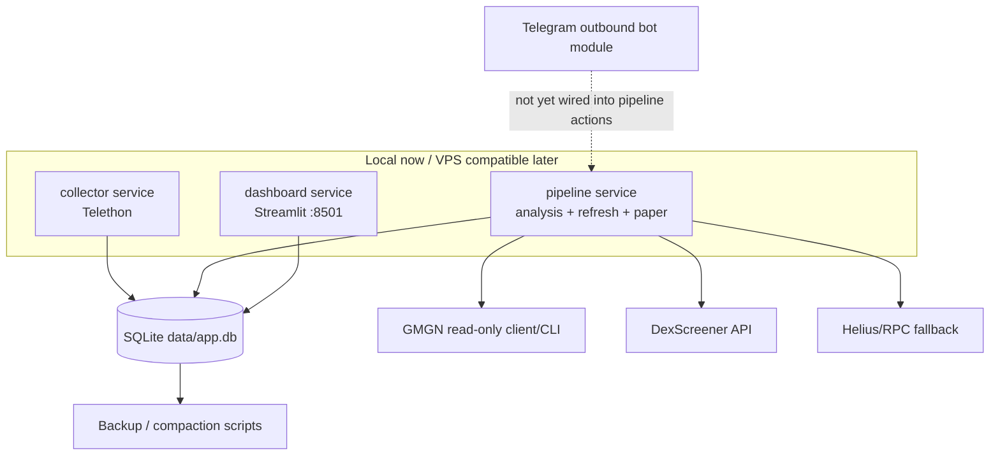
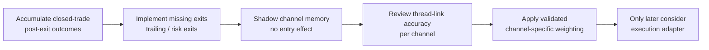

# Current Implementation Overview

기준 시각: 2026-05-25 14:06 KST

## V1 Safety Boundary

- Solana 전용 텔레그램 콜 분석 및 페이퍼 트레이딩 시스템이다.
- 실거래 실행은 구현하지 않았고 `DRY_RUN=true`가 기본값이다.
- 실제 private key를 요구하거나 사용하지 않는다.
- Telegram 수집은 Telethon 사용자 로그인 세션, 알림은 outbound bot 모듈을 전제로 한다.

## Current Snapshot

| 항목 | 수치 |
| --- | ---: |
| 저장된 Telegram 메시지 | 613 |
| LLM 분석 완료 | 613 |
| Solana CA 추출 행 | 67 |
| Call Events | 39 |
| 열린 Paper Position | 1 |
| 닫힌 Paper Position | 1 |
| Context Links | 0 |
| App Errors | 0 |

현재 Event 상태는 `OPEN 38`, `WATCH_RISK 1`이다. 시장 데이터 스냅샷은
`dexscreener 8,231`, `gmgn 2,655`, 열린 포지션 빠른 감시
`dexscreener_fast 527`, 닫힌 포지션 전용 관찰 `dexscreener_post_exit 1`건이다.

## System Flow

## Message To Call Event

이 연결은 짧게 분리된 `entry.` + `CA` 메시지를 처리하기 위한 현재 구현이다.
며칠 동안 이어지는 채널별 토큰 서사 기억은 아직 구현되지 않았다.

## Paper Trading Lifecycle

## Data And Services

VPS 이전 시 code는 GitHub로 배포하고, `.env`, `sessions/`, `data/`,
`config/channels.yaml`, `config/strategy.yaml`은 서버의 runtime state로 유지한다.

## Implementation Status

| 영역 | 상태 | 설명 |
| --- | --- | --- |
| Telethon 수집 | 구현 완료 | 접근 가능한 공개/비공개 설정 채널 메시지 저장 |
| Solana CA 추출 | 구현 완료 | Solana base58 mint address만 추출 |
| LLM 분류 | 구현 완료 | OpenAI 기본, 중요 저신뢰 intent 검토, Ollama fallback |
| 분리 게시글 문맥 | 구현 완료 | CA-only 메시지에 단일 60초 action context 연결, ambiguity 기록 |
| Call Event 병합 | 구현 완료 | 같은 채널과 같은 CA는 하나의 event |
| Market cap 기반 점수/손익 | 구현 완료 | price 대신 market cap을 핵심 기준으로 사용 |
| 시장/보안 데이터 | 구현 완료 범위 | GMGN / DexScreener 시장 데이터, GMGN / Helius security fallback |
| 열린 포지션 감시 | 구현 완료 | DexScreener batch 기반 기본 5초 monitor |
| 닫힌 포지션 사후 추적 | 구현 완료 | 기본 15분, 동일 토큰 최근 snapshot 재사용 |
| Streamlit dashboard | 구현 완료 | Context Links, Closed Trades 사후 평가 포함 |
| SQLite/VPS 구조 | 구현 완료 | Docker Compose, systemd, backup/compaction 문서와 스크립트 |
| Telegram 알림 | 부분 구현 | outbound bot client와 메시지 포맷은 있으나 pipeline trigger 연결 미확인/미구현 |
| 지갑/홀더 추적 | 부분 구현 | security snapshot은 저장 중, wallet activity table/view는 있으나 현재 행 0 |
| 고급 exit 규칙 | 부분 구현 | YAML에는 trailing/liquidity/major sell/max hold 설정이 있으나 엔진 실행은 stop loss/부분 익절/메시지 exit 중심 |
| 채널별 장기 기억 | 다음 단계 | active token threads + channel profile + shadow linking 필요 |

## Current Strategy And One Closed Trade

| 규칙 | 현재 값 |
| --- | ---: |
| 기본 진입 크기 | 0.5 SOL |
| 일일 최대 가상 손실 | 0.5 SOL |
| 최소 signal score | 55 |
| 최소 risk score | 65 |
| 최소 liquidity | $5,000 |
| Stop loss 설정 | -50% (2026-05-25 변경) |
| Take profit 1 | +30%에서 50% 청산 |
| Take profit 2 | +100%에서 30% 청산 |
| 열린 포지션 관찰 | 5초 |
| 닫힌 포지션 관찰 | 15분 |

닫힌 거래 한 건의 사후 추적 결과:

| 지표 | 값 |
| --- | ---: |
| 실제 실현 PnL | -0.1622 SOL |
| 사후 비교 기준 market cap | $294,782 |
| 청산 후 관측 최저 market cap | $119,128 |
| 계속 보유 시 최악 추정 수익률 | -61.61% |
| 청산 후 관측 최고 market cap | $950,179 |
| 계속 보유 시 최고 추정 수익률 | +206.22% |
| 최고점 추정 PnL | +1.0311 SOL |

이 사례는 변경 전 `-25%` stop loss로 종료된 과거 거래다. 현재 전략은
`-50%`로 변경되었으며, 앞으로의 사후 결과와 함께 비교 평가한다.

## Recommended Next Sequence

가장 현실적인 다음 확장은 채널별 agent를 별도 모델로 여러 개 운영하는 것이
아니라, `Channel Profile`과 `Active Token Threads`를 저장해 LLM에 제공하되
처음에는 페이퍼 진입 결정에 영향을 주지 않는 shadow 분석으로 정확도를 검증하는 것이다.
